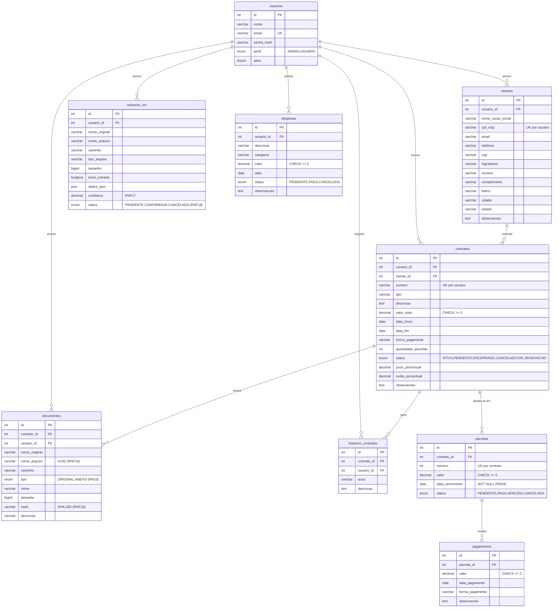

# ContractFlow — DER (Diagrama Entidade-Relacionamento)

> Gerado a partir de `api/database/schema.sql` (MySQL 8+). Todas as FKs usam
> `ON DELETE RESTRICT` (RN11: nada financeiro importante é removido em cascata).
> Isolamento por usuário (RNF04): `clientes.usuario_id` e `contratos.usuario_id`
> (desnormalizado de propósito para filtrar tudo pelo dono sem JOIN extra);
> parcelas, pagamentos e documentos são alcançados pela cadeia
> contrato → cliente → usuário.
>
> O DER canônico do time também está no Miro (ver card de Back-End no Trello);
> este arquivo é o espelho versionado no repositório.

## Cardinalidades (leitura)

| Relacionamento | Cardinalidade | Regra |
|---|---|---|
| usuarios → clientes | 1:N | Um usuário possui N clientes; cliente pertence a 1 usuário (RNF04) |
| usuarios → contratos | 1:N | Desnormalizado para filtro direto por dono (RNF04) |
| clientes → contratos | 1:N | Um cliente tem vários contratos (RN01); contrato exige 1 cliente (RN02) |
| contratos → parcelas | 1:N | Geradas automaticamente na criação (RF14/RF15) |
| parcelas → pagamentos | 1:N | Pagamento pertence a 1 parcela válida (RN06) |
| contratos → documentos | 1:N | ORIGINAL + ANEXOs (RN10, RF09/RF41) |
| contratos → historico_contratos | 1:N | Eventos de criação/alteração/pagamento/status (RF36) |
| usuarios → extracao_ocr | 1:N | Extrações pendentes de confirmação (RN09/RNF18) |
| usuarios → despesas | 1:N | Tabela pronta; controller da Sprint futura (RF25) |

## Índices (desempenho — RNF09)

FKs e campos de filtro possuem índices `idx_*`: `usuario_id` (todas as tabelas),
`cliente_id`, `status`, `data_vencimento`, `data_pagamento`, `contrato_id`,
`parcela_id`, `data`. Unicidades: `usuarios.email`, `(usuario_id, cpf_cnpj)`,
`(usuario_id, numero)` em contratos, `(contrato_id, numero)` em parcelas.
