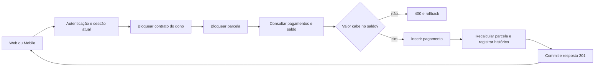

# ContractFlow — Entrega do backend da Sprint 2

Responsabilidade confirmada: **Guilherme Bazon, todo o backend**.
Implementação preparada com assistência do Codex; revisar o código e ensaiar os
fluxos antes da apresentação individual. Referência inicial: Sprint 1 `e753de5`.

Backend implementado e validado localmente. Produto final Web/Mobile ainda depende
da integração da equipe; não marcar essas telas/fluxos como concluídos nesta entrega.

## Links e estado verificável

- [Branch publicada: feature/sprint-2-backend](https://github.com/GuiBazon/contractflow/tree/feature/sprint-2-backend)
- [Comparação com main](https://github.com/GuiBazon/contractflow/compare/main...feature/sprint-2-backend)
- [Execuções do Actions na branch](https://github.com/GuiBazon/contractflow/actions?query=branch%3Afeature%2Fsprint-2-backend)
- [Workflow Backend versionado](../.github/workflows/backend.yml)
- [Notion informado](https://app.notion.com/p/ContractFlow-3c94bf8f7e4b80519094e41143914669)
- [Trello](https://trello.com/b/FMilhTuN/contractflow)
- [Figma](https://www.figma.com/design/aNfKBROulxyewRPhmNkW4l/ContractFlow?node-id=0-1)

A branch foi publicada sem merge em main. GitHub Actions remoto ainda precisa de
verificação pelo link: o acesso à API do GitHub no ambiente não foi validado.
A tentativa de abrir PR pela API GraphQL recebeu `Forbidden`; a consulta do
CLI também não validou a autenticação. O push via Git funcionou, mas não foi
possível abrir PR ou conferir a execução remota por esses caminhos.
Não afirmar que CI remoto passou com base nos testes locais.

Notion recebeu 403 pelo proxy; Trello/Figma vieram da documentação versionada.
Nenhum card/documento externo foi criado, movido ou atualizado. Os IDs BE-S2 são
referências locais; [cards preparados](CARDS_SPRINT_2.csv) permitem copiar aceite,
testes e evidências para os cards reais e vincular os membros da equipe.

## Entregas e commits

Os commits foram feitos após blocos reais de implementação/validação, com datas
reais. A rubrica avalia a relação tarefa → implementação → teste → entrega, não
quantidade de commits ou uma aparência de atividade distribuída artificialmente.

| Commit | Resultado | Evidência técnica |
| --- | --- | --- |
| [c51edbf](https://github.com/GuiBazon/contractflow/commit/c51edbf) | CI e testes com MySQL real | Workflow, Compose de teste, schema/constraints/isolamento |
| [1cc2886](https://github.com/GuiBazon/contractflow/commit/1cc2886) | Recebíveis, despesas e integridade financeira | Saldo parcial, cancelamento, oito pagamentos concorrentes |
| [13370ee](https://github.com/GuiBazon/contractflow/commit/13370ee) | Dashboard, calendário, alertas e relatórios | Mais de 100 registros, eventos, CSV e round-trip XLSX |
| [0b4f2f8](https://github.com/GuiBazon/contractflow/commit/0b4f2f8) | OCR português e confirmação íntegra | PDF/imagem/scan, revisão, concorrência e compensação do arquivo |
| [7febb27](https://github.com/GuiBazon/contractflow/commit/7febb27) | Gestão de usuários e revogação | Permissão atual, último ADMIN, senha/logout e migração aditiva |
| [3893101](https://github.com/GuiBazon/contractflow/commit/3893101) | Regressão dos CRUDs/anexos | Replanejamento, parcelas extras, locks e validação de arquivos |
| [1430d2a](https://github.com/GuiBazon/contractflow/commit/1430d2a) | Dependências corrigidas | Express/Multer/qs/uuid; audit de produção com zero alertas |
| [235998b](https://github.com/GuiBazon/contractflow/commit/235998b) | Calculadora e renovação | Mesmos centavos/datas da criação; origem/histórico e rollback |
| [44faaf5](https://github.com/GuiBazon/contractflow/commit/44faaf5) | Cobertura combinada e Docker | 117 testes, filtros/exports vazios e runtime offline como node |

Última documentação complementa esses commits com os requisitos, cards e roteiro.
`main` permanece como referência da Sprint 1 até revisão/merge pela equipe.

## Validação realizada

| Verificação | Resultado local |
| --- | --- |
| `npm test -- --ci --runInBand --coverage` | 84 testes passaram, seis suítes |
| `npm run test:mysql -- --ci --coverage` | 33 cenários passaram, sete suítes |
| `npm run coverage:merge` | 91,09% linhas; 85,68% instruções; 71,13% ramificações; 92,90% funções |
| `npm ci` | Instalação reproduzível com o lockfile atual |
| `npm audit --omit=dev` | Zero vulnerabilidades reportadas |
| Docker build/runtime | Node 24, UID 1000; migração, login, financeiro, CSV/XLSX e OCR textual/PNG/scan passaram |
| OCR na imagem | Modelo português local e Poppler; testes em rede Docker interna sem internet |
| Ambiente cloud | Instalação/start reutilizáveis; DB demo preservado; API e proxy Web com login/listagens passaram |

Cobertura mede controllers/services/utils/middlewares. Não mede telas, carga,
infraestrutura em produção ou todas as falhas possíveis do host. Relatório local
em `api/coverage/combined/index.html` e artifacts previstos no workflow.
[Organização dos cenários](../api/tests/mysql/README.md) e [como executar](../api/README.md).

## Cards de backend e integração

Estado comum do backend: **implementado e validado localmente**.
Estado dos cards externos/CI remoto/telas: **pendente de vinculação/validação**.
Responsável backend: Bazon; a equipe deve vincular responsáveis reais de Web/Mobile.

| ID local | Entrega | Commits / testes | Próximo aceite conjunto |
| --- | --- | --- | --- |
| BE-S2-01 | GitHub Actions | c51edbf, 44faaf5; duas suítes e cobertura | Abrir run/PR e verificar os três jobs |
| BE-S2-02 | Contratos de integração | API_SPRINT_2.md, ENDPOINTS.md | URL da API por ambiente; estados de erro/401 nas telas |
| BE-S2-03 | MySQL real | c51edbf, 44faaf5; 33 cenários | Repetir em banco exclusivo; anexar resultado no card |
| BE-S2-04 | Recebíveis/pagamentos | 1cc2886, 3893101; finance/crud | Saldo parcial igual no detalhe, financeiro e dashboard |
| BE-S2-05 | Despesas | 1cc2886; finance | CRUD de despesas e proteção dos registros pagos nas telas |
| BE-S2-06 | Dashboard/projeção | 13370ee, 235998b; analytics/extensions | Substituir somas de páginas por `/dashboard` |
| BE-S2-07 | Agenda/alertas | 13370ee; analytics | Consumir `/calendario` e `/alertas`; navegar ao contrato |
| BE-S2-08 | OCR de documentos | 0b4f2f8; ocr | Upload/revisão com avisos, timeout e correção manual |
| BE-S2-09 | Confirmação OCR | 0b4f2f8; ocr | Mostrar contrato/parcelas/original após confirmar; tratar 409 |
| BE-S2-10 | Usuários/sessões | 7febb27; auth | ADMIN/USUARIO, desativação/rebaixamento, novo login após revogação |
| BE-S2-11 | Relatórios/exportação | 13370ee, 1430d2a; analytics | Download real CSV/XLSX com filtros iguais aos da tela |
| BE-S2-12 | Regressão/apresentação | 3893101, 235998b, 44faaf5; crud/extensions | CRUDs, busca/anexos, calculadora, renovação e ensaio do produto |

Registrar em cada card real: responsável → link da branch/commit/PR → funcionalidade
→ cenário de teste → resultado → conclusão da API. Marcar dependência de tela
separadamente. Não registrar movimentações/participação em dias que não ocorreram.

## Integrações ainda necessárias

1. **Web**: no checkout inspecionado, login/cadastro/listagem de contratos não
   cobrem os CRUDs e módulos previstos. Integrar os endpoints de clientes,
   contratos/detalhe, pagamentos, despesas, dashboard, agenda, OCR e relatórios.
2. **Mobile**: Dashboard/Financeiro/Agenda derivam dados de páginas de até 100
   contratos/pagamentos. Usar os endpoints agregados/paginados; descontar pagamentos
   parciais no atraso e tratar canceladas/quitadas conforme o tipo de evento.
3. **Calculadora**: usar `/calculadora` ou alinhar a regra local. Hoje há divergência
   de centavos e a tela avança o mês quando o início é dia 1. API começa na data
   informada e mantém o dia-base; R$ 1000/6 produz 166,66 nas primeiras e 166,70 na última.
4. **Autenticação**: 401 por sessão revogada exige limpar sessão/novo login. Usuário
   comum não pode abrir gestão administrativa. ADMIN não vê financeiro de outros.
5. **Documentos/OCR**: multipart `arquivo`, revisão/confirmação com `dados`; revisão
   não cria contrato. Após confirmar, recarregar contratos/parcelas/original.
   PDF escaneado pode levar mais tempo: tratar progresso, timeout e 429.
6. **Exportação**: Web solicita blob; Mobile salva/compartilha o arquivo. Paginação
   da tela não limita a exportação, que inclui todos os filtros até 10000 registros.
7. **Renovação**: ação explícita com novo número/período/valores; informar que o
   anterior fica encerrado e que o novo documento deve ser anexado.
8. **Rede/protótipo**: remover IP fixo por configuração, testar celular físico,
   estados de erro, navegação e correspondência ao Figma. Proxy cloud só valida
   o acesso local; não prova que a rede/equipamento da apresentação funcionará.

Formatos completos, erros, limites e regras: [API_SPRINT_2.md](API_SPRINT_2.md).
Recuperação sem login, push/e-mail, estorno e cobrança automática de encargos não
foram entregues. Oportunidades opcionais devem ter escopo final registrado com a
equipe; não apagar requisitos prometidos para apresentar uma matriz toda verde.

## Percurso técnico individual

### Pagamento parcial e concorrência

Localize [rota](../api/src/routes/contractRoutes.js),
[autenticação](../api/src/middlewares/authMiddleware.js),
[controller](../api/src/controllers/paymentController.js),
[lock do contrato](../api/src/services/contratoService.js) e
[cálculo financeiro](../api/src/services/financeiroService.js).

Entrada: contrato/parcela, valor, data, forma. Processamento: ownership, locks em
ordem comum, saldo em centavos, INSERT, atualização de situação, histórico e
commit. Saída: pagamento e novo total pago/quitado. O lock faz o segundo pedido
consultar o saldo após o primeiro commit; só validar fora da transação permitia
sobrepagamento. Abra [teste concorrente](../api/tests/mysql/finance.test.js).

### OCR e banco/disco

Localize [controller](../api/src/controllers/ocrController.js) e
[serviço de leitura](../api/src/services/ocrService.js).
Extração produz uma sugestão PENDENTE; revisão salva JSON; confirmação cria cliente,
contrato, parcelas, original e histórico na mesma conexão/transação.

Disco não participa do rollback SQL: a cópia do original ocorre antes do commit
SQL e é removida em falha. O original permanece disponível para corrigir/repetir.
O lock da extração evita confirmação dupla. Abra o cenário que remove o arquivo
original antes de confirmar e prova ausência de cliente/contrato parcial em
[ocr.test.js](../api/tests/mysql/ocr.test.js). Uma interrupção abrupta do host pode
produzir arquivo sem referência; a compensação cobre erros retornados da operação.

### Permissões e migração

O JWT identifica a sessão, mas perfil/ativo/token_version são relidos no banco.
Atualização administrativa, senha e logout revogam sessões. A migração adiciona
versão de sessão ao banco existente, registra checksum e preserva usuários.
Localize [middleware](../api/src/middlewares/authMiddleware.js),
[gestão de contas](../api/src/controllers/userController.js),
[migração](../api/database/migrations/001-session-version.js) e
[cenários](../api/tests/mysql/auth.test.js).

## Ensaio da apresentação

1. Iniciar API/banco/interfaces no equipamento/rede previstos; confirmar login.
2. Cadastrar cliente e contrato; mostrar parcelas, datas e detalhe financeiro.
3. Registrar pagamento parcial e depois integral; mostrar saldo, receita,
   atraso/histórico e proteção contra pagamento excedente.
4. Cadastrar despesa e demonstrar dashboard/projeção/agenda com os mesmos dados.
5. Importar a [amostra PDF](../api/tests/fixtures/contrato-texto.pdf) ou
   [imagem](../api/tests/fixtures/contrato.png); revisar campos, confirmar e abrir original.
6. Demonstrar exportação/renovação/permissões previstas nas telas finais.
7. Abrir um card próprio, commit e teste/Actions da funcionalidade apresentada;
   percorrer entrada → API → regra → banco → resposta → interface e explicar uma falha.

Apresentar a funcionalidade individual **na interface em funcionamento**, conforme
a rubrica. Postman/curl e código servem de evidência técnica complementar.
Ensaiar em equipe e reservar margem até 03/11 para falhas de integração/rede.
